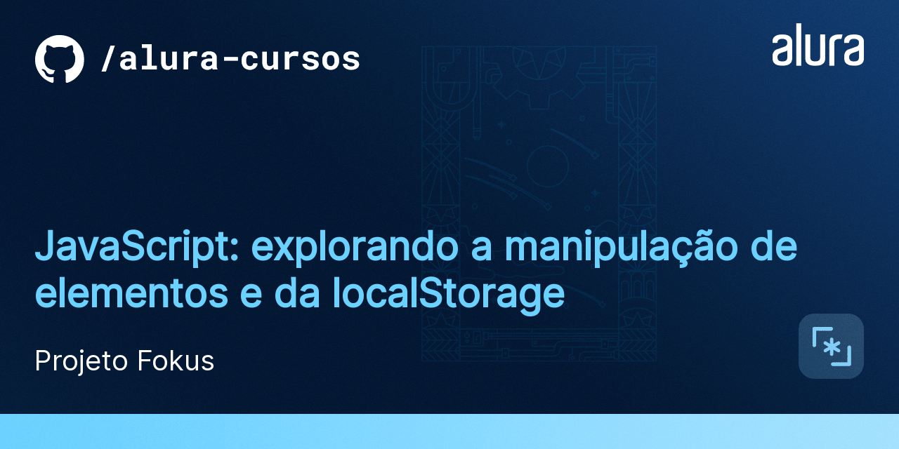

# Fokus 2.0

Este projeto faz parte do meu aprendizado de JavaScript, no curso da Alura: JavaScript: explorando a manipulação de elementos e da localStorage 

Neste curso pude desenvolver mais o projeto **Fokus**, que é um aplicativo baseado no **método pomodoro**, que se baseia em períodos mais longos de trabalho ou estudo, seguidos de pausas curtas para descanso e pausas longas para recobrar as energias.

Link dos designs da aplicação: https://www.figma.com/design/dEaMv34Wd5G7TBMPo8fPlK/Projeto-Fokus?node-id=35-181&p=f&t=2IKnCzz7ufoADUM4-0

## Sobre o projeto

Esse projeto é uma aplicação web simples e interativa que permite aos usuários adicionar, editar, visualizar e remover tarefas, tudo em um ambiente visual agradável e amigável. ELe foi utilizado principalmente para desenvolver minhas habilidades em JavaScript e manipulação da DOM.

## Funcionalidades do projeto

1. Adicionar Tarefas: ao clicar em um botão é revelado um formulário onde você pode escrever e adicionar novas tarefas;
2. Editar Tarefas: ao clicar no botão de editar, você pode alterar a descrição da tarefa;
3. Visualizar Tarefas: as tarefas adicionadas estarão organizadas, facilitando a execução;
4. Marcar Tarefas como Completas: quando uma tarefa é finalizada, ela muda de aparência para facilitar o entendimento e uso do sistema;
5. Remover Tarefas: Seja seletivo e remova apenas as tarefas completas ou exclua a lista completa e comece de novo com uma lista de tarefas limpa.

## Técnicas e Tecnologias

- `Manipulação da DOM`: aprendi a manipular a estrutura da página com JavaScript, criando, removendo e alterando elementos HTML;
- `Eventos JavaScript`: utilizei o poder dos eventos JavaScript para criar uma interface interativa e responsiva;
- `LocalStorage`: utilizei o LocalStorage para armazenar e recuperar dados, mantendo as tarefas seguras e acessíveis mesmo após o navegador ser fechado.

## Como Abrir e Rodar o Projeto

1. Certifique-se de que você tem um navegador web moderno instalado. Recomendo o uso do Google Chrome ou Mozilla Firefox;
2. Abra a pasta onde o projeto foi baixado ou extraído, você encontrará um arquivo chamado index.html, a raíz do projeto;
3. Ao abrir o arquivo index.html, o projeto será aberto em seu navegador padrão, e você já poderá utilizar a aplicação de gerenciamento de tarefas.

Com isso, o sistema conta agora não só com um **pomodoro clássico**, mas com uma funcionalidade completa de **gestão de tarefas e focos!**
